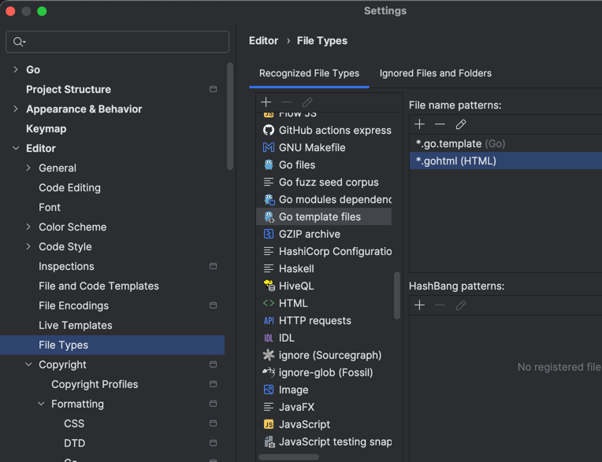

# IDE integration

### File watcher
- Configure a file-watcher to run `gohtml`
  - eg: `gohtml`
  - or: `gohtml -c frontend/gohtml.taml`

### Goland - associate .gohtml file extension
> Set "HTML" as the template data language.

